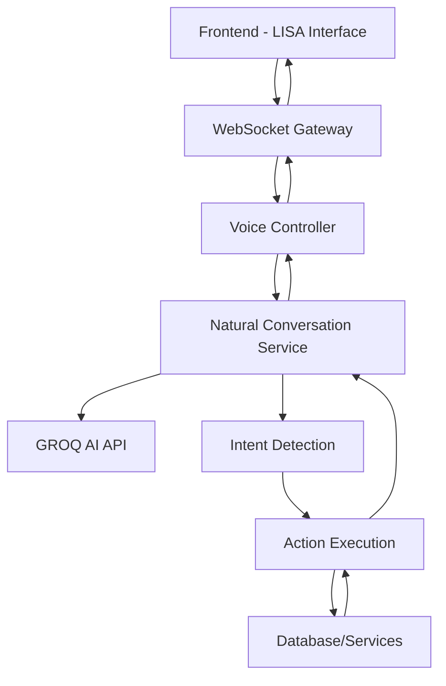

# LISA - AI Voice Assistant Implementation Guide

**L**anguage **I**ntelligent **S**peech **A**ssistant - A comprehensive voice-enabled AI assistant for web applications.

## 🎯 **Overview**

LISA is a production-ready voice assistant that provides natural language interaction, real-time conversation, and intelligent command processing for web applications. Originally built for the Glass Order Management System, LISA can be adapted for any application requiring voice interaction.

---

## 🚀 **Core Features**

### **Voice Capabilities**
- ✅ **Speech-to-Text (STT)** - Real-time voice recognition
- ✅ **Text-to-Speech (TTS)** - Natural voice responses
- ✅ **Wake Word Detection** - "Hey LISA" activation
- ✅ **Conversation Management** - Multi-turn dialogues
- ✅ **Voice Interruption** - Stop/interrupt commands
- ✅ **Audio Permission Management** - Seamless microphone access

### **AI & Natural Language**
- ✅ **Intent Detection** - Smart command understanding
- ✅ **Context Awareness** - Maintains conversation context
- ✅ **Fallback Handling** - Graceful error recovery
- ✅ **Custom Commands** - Domain-specific actions
- ✅ **Response Generation** - AI-powered replies

### **User Interface**
- ✅ **Floating Interface** - Minimalist circular design
- ✅ **Expandable Menu** - Contextual controls
- ✅ **Visual Feedback** - Real-time status indicators
- ✅ **Responsive Design** - Mobile & desktop optimized
- ✅ **Accessibility** - Screen reader compatible

### **Technical Architecture**
- ✅ **WebSocket Communication** - Real-time bidirectional
- ✅ **State Management** - React hooks & context
- ✅ **Error Handling** - Robust error management
- ✅ **Performance Optimization** - Debounced processing
- ✅ **Cross-browser Support** - Chrome, Firefox, Safari, Edge

---

## 📦 **Required Packages**

### **Frontend Dependencies**

```json
{
  "dependencies": {
    // Core React & UI
    "@mui/material": "^5.15.20",
    "@mui/icons-material": "^5.15.20",
    "@emotion/react": "^11.11.4",
    "@emotion/styled": "^11.11.5",
    
    // Voice & Audio
    "react-speech-kit": "^3.0.1",
    
    // WebSocket Communication
    "socket.io-client": "^4.7.5",
    
    // HTTP Client
    "axios": "^1.7.2",
    
    // State Management
    "react": "^18.3.1",
    "react-dom": "^18.3.1"
  }
}
```

### **Backend Dependencies**

```json
{
  "dependencies": {
    // NestJS Framework
    "@nestjs/common": "^10.0.0",
    "@nestjs/core": "^10.0.0",
    "@nestjs/platform-express": "^10.0.0",
    "@nestjs/websockets": "^10.0.0",
    "@nestjs/platform-socket.io": "^10.0.0",
    "@nestjs/config": "^3.0.0",
    
    // AI & Language Processing
    "groq-sdk": "^0.5.0",
    
    // WebSocket
    "socket.io": "^4.7.5",
    
    // Utilities
    "rxjs": "^7.8.1",
    "class-validator": "^0.14.0",
    "class-transformer": "^0.5.1"
  }
}
```

---

## 🏗 **Architecture Overview**

### **System Components**



### **Data Flow**

1. **Voice Input** → Speech Recognition → Text
2. **Text Processing** → Intent Detection → Action
3. **Action Execution** → Business Logic → Response
4. **Response Generation** → AI Processing → Reply
5. **Voice Output** → Text-to-Speech → Audio

---

## 🛠 **Implementation Guide**

### **1. Backend Setup**

#### **WebSocket Gateway**
```typescript
// src/voice/voice.gateway.ts
import {
  WebSocketGateway,
  SubscribeMessage,
  MessageBody,
  ConnectedSocket,
  WebSocketServer,
} from '@nestjs/websockets';
import { Server, Socket } from 'socket.io';
import { Injectable, Logger } from '@nestjs/common';
import { NaturalConversationService } from './natural-conversation.service';

@WebSocketGateway({
  cors: {
    origin: process.env.CORS_ORIGIN || "http://localhost:5173",
    methods: ["GET", "POST"],
    credentials: true,
  },
  namespace: '/voice',
})
@Injectable()
export class VoiceGateway {
  @WebSocketServer()
  server: Server;
  
  private readonly logger = new Logger(VoiceGateway.name);
  
  constructor(
    private readonly conversationService: NaturalConversationService,
  ) {}

  @SubscribeMessage('voice-command')
  async handleVoiceCommand(
    @MessageBody() data: { transcript: string },
    @ConnectedSocket() client: Socket,
  ) {
    try {
      const response = await this.conversationService.processVoiceCommand(
        data.transcript,
        client.id,
      );
      
      client.emit('voice-response', response);
    } catch (error) {
      this.logger.error('Voice command error:', error);
      client.emit('voice-error', { 
        message: 'Sorry, I encountered an error processing your request.' 
      });
    }
  }

  // ...additional message handlers
}
```

#### **Natural Conversation Service**
```typescript
// src/voice/natural-conversation.service.ts
import { Injectable, Logger } from '@nestjs/common';
import { ConfigService } from '@nestjs/config';
import Groq from 'groq-sdk';

@Injectable()
export class NaturalConversationService {
  private readonly logger = new Logger(NaturalConversationService.name);
  private groq: Groq;
  private conversationHistory = new Map<string, any[]>();

  constructor(private configService: ConfigService) {
    const apiKey = this.configService.get<string>('GROQ_API_KEY');
    if (apiKey) {
      this.groq = new Groq({ apiKey });
    }
  }

  async processVoiceCommand(transcript: string, sessionId: string) {
    // Intent detection
    const intent = this.detectIntent(transcript);
    
    // Execute action based on intent
    const actionResult = await this.executeAction(intent, transcript);
    
    // Generate AI response
    const aiResponse = await this.generateResponse(transcript, actionResult, sessionId);
    
    return {
      transcript,
      intent: intent.name,
      response: aiResponse,
      data: actionResult.data,
    };
  }

  private detectIntent(transcript: string) {
    const lower = transcript.toLowerCase();
    
    // Search intents
    if (this.containsSearchKeywords(lower)) {
      return { name: 'search_orders', confidence: 0.9 };
    }
    
    // Add more intent patterns...
    
    return { name: 'general', confidence: 0.5 };
  }

  private async executeAction(intent: any, transcript: string) {
    switch (intent.name) {
      case 'search_orders':
        return await this.searchOrders(transcript);
      // Add more actions...
      default:
        return { data: null };
    }
  }

  private async generateResponse(transcript: string, actionResult: any, sessionId: string) {
    if (!this.groq) {
      return this.getFallbackResponse(transcript, actionResult);
    }

    try {
      const completion = await this.groq.chat.completions.create({
        messages: [
          {
            role: 'system',
            content: 'You are LISA, an AI assistant for order management...'
          },
          {
            role: 'user',
            content: transcript
          }
        ],
        model: 'llama3-8b-8192',
        temperature: 0.7,
        max_tokens: 500,
      });

      return completion.choices[0]?.message?.content || 'I understand your request.';
    } catch (error) {
      this.logger.error('GROQ API error:', error);
      return this.getFallbackResponse(transcript, actionResult);
    }
  }
}
```

### **2. Frontend Implementation**

#### **LISA Interface Component**
```typescript
// src/components/LISAInterface.tsx
import React, { useState, useEffect, useRef } from 'react';
import { 
  Fab, 
  Paper, 
  IconButton, 
  Box, 
  Typography,
  Fade,
  CircularProgress 
} from '@mui/material';
import { 
  Mic, 
  MicOff, 
  VolumeUp, 
  Close, 
  SettingsVoice 
} from '@mui/icons-material';
import { useSpeechSynthesis, useSpeechRecognition } from 'react-speech-kit';
import { useVoiceSocket } from '../hooks/useVoiceSocket';

const LISAInterface: React.FC = () => {
  const [isExpanded, setIsExpanded] = useState(false);
  const [isListening, setIsListening] = useState(false);
  const [isSpeaking, setIsSpeaking] = useState(false);
  const [transcript, setTranscript] = useState('');
  const [response, setResponse] = useState('');

  // Voice hooks
  const { speak, cancel: cancelSpeech, speaking } = useSpeechSynthesis();
  const { listen, stop, supported } = useSpeechRecognition({
    onResult: (result) => setTranscript(result),
    onEnd: () => setIsListening(false),
  });

  // WebSocket connection
  const { 
    socket, 
    isConnected, 
    sendVoiceCommand, 
    lastResponse 
  } = useVoiceSocket();

  // Handle voice input
  const startListening = () => {
    if (supported) {
      setIsListening(true);
      listen({ continuous: true, interimResults: true });
    }
  };

  const stopListening = () => {
    setIsListening(false);
    stop();
    
    if (transcript.trim()) {
      sendVoiceCommand(transcript);
      setTranscript('');
    }
  };

  // Handle AI responses
  useEffect(() => {
    if (lastResponse?.response) {
      setResponse(lastResponse.response);
      speak({ text: lastResponse.response });
    }
  }, [lastResponse, speak]);

  // Main interface
  return (
    <Box
      sx={{
        position: 'fixed',
        bottom: 24,
        right: 24,
        zIndex: 1300,
      }}
    >
      {/* Expanded Menu */}
      <Fade in={isExpanded}>
        <Paper
          elevation={8}
          sx={{
            position: 'absolute',
            bottom: 80,
            right: 0,
            p: 2,
            minWidth: 300,
            maxWidth: 400,
            borderRadius: 2,
          }}
        >
          <Box sx={{ display: 'flex', justifyContent: 'space-between', mb: 2 }}>
            <Typography variant="h6" color="primary">
              LISA Assistant
            </Typography>
            <IconButton size="small" onClick={() => setIsExpanded(false)}>
              <Close />
            </IconButton>
          </Box>

          {/* Voice Controls */}
          <Box sx={{ display: 'flex', gap: 1, mb: 2 }}>
            <IconButton
              color={isListening ? 'error' : 'primary'}
              onClick={isListening ? stopListening : startListening}
              disabled={!supported || !isConnected}
            >
              {isListening ? <MicOff /> : <Mic />}
            </IconButton>
            
            <IconButton
              color="secondary"
              onClick={() => cancelSpeech()}
              disabled={!speaking}
            >
              <VolumeUp />
            </IconButton>
          </Box>

          {/* Status & Transcript */}
          {isListening && (
            <Box sx={{ mb: 2 }}>
              <Typography variant="caption" color="primary">
                Listening...
              </Typography>
              {transcript && (
                <Typography variant="body2" sx={{ mt: 1 }}>
                  "{transcript}"
                </Typography>
              )}
            </Box>
          )}

          {/* AI Response */}
          {response && (
            <Box sx={{ mt: 2 }}>
              <Typography variant="caption" color="text.secondary">
                LISA:
              </Typography>
              <Typography variant="body2" sx={{ mt: 0.5 }}>
                {response}
              </Typography>
            </Box>
          )}

          {/* Connection Status */}
          <Typography 
            variant="caption" 
            color={isConnected ? 'success.main' : 'error.main'}
            sx={{ display: 'block', mt: 1 }}
          >
            {isConnected ? '🟢 Connected' : '🔴 Disconnected'}
          </Typography>
        </Paper>
      </Fade>

      {/* Main FAB */}
      <Fab
        color="primary"
        onClick={() => setIsExpanded(!isExpanded)}
        sx={{
          background: 'linear-gradient(45deg, #2196F3 30%, #21CBF3 90%)',
          '&:hover': {
            background: 'linear-gradient(45deg, #1976D2 30%, #0288D1 90%)',
          },
        }}
      >
        {speaking ? (
          <CircularProgress size={24} color="inherit" />
        ) : (
          <SettingsVoice />
        )}
      </Fab>
    </Box>
  );
};

export default LISAInterface;
```

#### **Voice Socket Hook**
```typescript
// src/hooks/useVoiceSocket.ts
import { useEffect, useState } from 'react';
import { io, Socket } from 'socket.io-client';

interface VoiceResponse {
  transcript: string;
  intent: string;
  response: string;
  data: any;
}

export const useVoiceSocket = () => {
  const [socket, setSocket] = useState<Socket | null>(null);
  const [isConnected, setIsConnected] = useState(false);
  const [lastResponse, setLastResponse] = useState<VoiceResponse | null>(null);

  useEffect(() => {
    const socketInstance = io(`${import.meta.env.VITE_WEBSOCKET_URL}/voice`, {
      transports: ['websocket'],
      timeout: 20000,
    });

    socketInstance.on('connect', () => {
      setIsConnected(true);
      console.log('🎤 LISA voice connection established');
    });

    socketInstance.on('disconnect', () => {
      setIsConnected(false);
      console.log('🔇 LISA voice connection lost');
    });

    socketInstance.on('voice-response', (response: VoiceResponse) => {
      setLastResponse(response);
    });

    socketInstance.on('voice-error', (error) => {
      console.error('LISA voice error:', error);
    });

    setSocket(socketInstance);

    return () => {
      socketInstance.disconnect();
    };
  }, []);

  const sendVoiceCommand = (transcript: string) => {
    if (socket && isConnected) {
      socket.emit('voice-command', { transcript });
    }
  };

  return {
    socket,
    isConnected,
    sendVoiceCommand,
    lastResponse,
  };
};
```

---

## 🎯 **Domain-Specific Customization**

### **Intent Detection Patterns**

Customize LISA for your application by modifying intent detection:

```typescript
// Example for E-commerce
private detectIntent(transcript: string) {
  const lower = transcript.toLowerCase();
  
  if (lower.includes('order') || lower.includes('purchase')) {
    return { name: 'order_management', confidence: 0.9 };
  }
  
  if (lower.includes('product') || lower.includes('search')) {
    return { name: 'product_search', confidence: 0.8 };
  }
  
  if (lower.includes('account') || lower.includes('profile')) {
    return { name: 'account_management', confidence: 0.7 };
  }
  
  return { name: 'general', confidence: 0.5 };
}
```

### **Custom Actions**

Implement domain-specific actions:

```typescript
private async executeAction(intent: any, transcript: string) {
  switch (intent.name) {
    case 'order_management':
      return await this.handleOrderCommands(transcript);
    
    case 'product_search':
      return await this.searchProducts(transcript);
    
    case 'account_management':
      return await this.handleAccountCommands(transcript);
    
    default:
      return { data: null };
  }
}
```

---

## ⚙️ **Configuration**

### **Environment Variables**

```bash
# Frontend (.env)
VITE_ENABLE_VOICE=true
VITE_API_URL=http://localhost:3001
VITE_WEBSOCKET_URL=ws://localhost:3001

# Backend (.env)
GROQ_API_KEY=your_groq_api_key_here
CORS_ORIGIN=http://localhost:5173
PORT=3001
```

### **Voice Settings**

```typescript
// Voice recognition configuration
const voiceConfig = {
  continuous: true,
  interimResults: true,
  language: 'en-US',
  maxAlternatives: 1,
};

// Speech synthesis configuration
const speechConfig = {
  rate: 0.9,
  pitch: 1.0,
  voice: null, // Auto-select best voice
};
```

---

## 🔧 **Production Deployment**

### **Performance Optimizations**

1. **Debounced Processing**
```typescript
const debouncedSendCommand = useMemo(
  () => debounce((transcript: string) => {
    sendVoiceCommand(transcript);
  }, 500),
  [sendVoiceCommand]
);
```

2. **Connection Management**
```typescript
// Automatic reconnection
useEffect(() => {
  const interval = setInterval(() => {
    if (!isConnected && socket) {
      socket.connect();
    }
  }, 5000);
  
  return () => clearInterval(interval);
}, [isConnected, socket]);
```

3. **Error Handling**
```typescript
const handleVoiceError = (error: any) => {
  console.error('Voice error:', error);
  
  // Fallback to text input
  setVoiceEnabled(false);
  
  // Show user-friendly message
  showNotification('Voice temporarily unavailable. Please try again.');
};
```

### **Security Considerations**

- **Audio Permissions**: Request microphone access gracefully
- **Data Privacy**: Process voice data securely
- **Rate Limiting**: Implement API call limits
- **Input Validation**: Sanitize voice transcripts

---

## 📱 **Browser Compatibility**

### **Supported Features**

| Browser | Speech Recognition | Speech Synthesis | WebSocket |
|---------|-------------------|------------------|-----------|
| Chrome  | ✅ Full          | ✅ Full         | ✅ Full   |
| Firefox | ❌ Limited       | ✅ Full         | ✅ Full   |
| Safari  | ❌ No            | ✅ Full         | ✅ Full   |
| Edge    | ✅ Full          | ✅ Full         | ✅ Full   |

### **Fallback Strategies**

```typescript
// Check browser support
const checkVoiceSupport = () => {
  const hasRecognition = 'webkitSpeechRecognition' in window || 'SpeechRecognition' in window;
  const hasSynthesis = 'speechSynthesis' in window;
  
  return {
    recognition: hasRecognition,
    synthesis: hasSynthesis,
    full: hasRecognition && hasSynthesis,
  };
};
```

---

## 🎨 **UI Customization**

### **Theme Integration**

```typescript
// Material-UI theme customization
const voiceTheme = {
  palette: {
    voice: {
      primary: '#2196F3',
      secondary: '#21CBF3',
      error: '#f44336',
      success: '#4caf50',
    },
  },
  components: {
    MuiFab: {
      styleOverrides: {
        root: {
          background: 'linear-gradient(45deg, #2196F3 30%, #21CBF3 90%)',
        },
      },
    },
  },
};
```

### **Animation & Effects**

```typescript
// Voice activity visualization
const VoiceVisualizer = ({ isActive }: { isActive: boolean }) => (
  <Box
    sx={{
      width: 60,
      height: 60,
      borderRadius: '50%',
      background: isActive 
        ? 'radial-gradient(circle, rgba(33,150,243,0.3) 0%, transparent 70%)'
        : 'transparent',
      animation: isActive ? 'pulse 1.5s infinite' : 'none',
      '@keyframes pulse': {
        '0%': { transform: 'scale(1)', opacity: 1 },
        '50%': { transform: 'scale(1.1)', opacity: 0.7 },
        '100%': { transform: 'scale(1)', opacity: 1 },
      },
    }}
  />
);
```

---

## 🧪 **Testing**

### **Unit Tests**

```typescript
// Voice service testing
describe('NaturalConversationService', () => {
  it('should detect search intent', () => {
    const service = new NaturalConversationService();
    const intent = service.detectIntent('show me expensive orders');
    expect(intent.name).toBe('search_orders');
  });
  
  it('should handle API errors gracefully', async () => {
    const service = new NaturalConversationService();
    const response = await service.processVoiceCommand('test', 'session1');
    expect(response).toBeDefined();
  });
});
```

### **Integration Tests**

```typescript
// WebSocket testing
describe('Voice Gateway', () => {
  it('should handle voice commands', async () => {
    const gateway = new VoiceGateway();
    const mockSocket = { emit: jest.fn() };
    
    await gateway.handleVoiceCommand(
      { transcript: 'test command' },
      mockSocket as any
    );
    
    expect(mockSocket.emit).toHaveBeenCalled();
  });
});
```

---

## 📊 **Monitoring & Analytics**

### **Voice Metrics**

```typescript
// Track voice usage
const trackVoiceMetrics = {
  commandsProcessed: 0,
  successRate: 0,
  averageResponseTime: 0,
  popularCommands: new Map(),
  
  record(command: string, success: boolean, responseTime: number) {
    this.commandsProcessed++;
    this.successRate = (this.successRate + (success ? 1 : 0)) / this.commandsProcessed;
    this.averageResponseTime = (this.averageResponseTime + responseTime) / this.commandsProcessed;
    
    const count = this.popularCommands.get(command) || 0;
    this.popularCommands.set(command, count + 1);
  }
};
```

### **Performance Monitoring**

```typescript
// Monitor WebSocket connection
const monitorConnection = () => {
  const metrics = {
    connectionUptime: 0,
    reconnectionCount: 0,
    messageLatency: [],
  };
  
  socket.on('connect', () => {
    metrics.connectionUptime = Date.now();
  });
  
  socket.on('disconnect', () => {
    metrics.reconnectionCount++;
  });
  
  return metrics;
};
```

---

## 🚀 **Quick Start for New Applications**

### **1. Install Dependencies**
```bash
# Frontend
npm install @mui/material @mui/icons-material react-speech-kit socket.io-client

# Backend  
npm install @nestjs/websockets @nestjs/platform-socket.io groq-sdk socket.io
```

### **2. Copy Core Files**
- `LISAInterface.tsx` - Main voice interface
- `useVoiceSocket.ts` - WebSocket hook
- `voice.gateway.ts` - WebSocket gateway
- `natural-conversation.service.ts` - AI service

### **3. Configure Environment**
```bash
# Add to .env
VITE_ENABLE_VOICE=true
GROQ_API_KEY=your_key_here
```

### **4. Customize Intents**
- Modify `detectIntent()` for your domain
- Add custom actions in `executeAction()`
- Update AI prompts for your use case

### **5. Deploy & Test**
- Test voice recognition
- Verify WebSocket connection
- Validate AI responses

---

## 📚 **Additional Resources**

### **Documentation Links**
- [GROQ API Documentation](https://console.groq.com/docs)
- [Web Speech API Guide](https://developer.mozilla.org/en-US/docs/Web/API/Web_Speech_API)
- [Socket.IO Documentation](https://socket.io/docs/)
- [Material-UI Components](https://mui.com/components/)

### **Example Applications**
- **E-commerce**: Product search, order tracking
- **CRM**: Customer lookup, appointment booking  
- **Healthcare**: Patient records, scheduling
- **Education**: Course navigation, Q&A

---

## 🎉 **Conclusion**

LISA provides a complete, production-ready voice assistant solution that can be easily integrated into any web application. With its modular architecture, comprehensive feature set, and detailed documentation, LISA enables developers to quickly add intelligent voice interaction to their applications.

**Key Benefits:**
- 🚀 **Fast Integration** - Copy & customize core components
- 🎯 **Domain Agnostic** - Adaptable to any application type
- 💪 **Production Ready** - Robust error handling & performance
- 🔧 **Highly Customizable** - Flexible configuration & theming
- 📱 **Cross-Platform** - Works on desktop & mobile browsers

Start building with LISA today and transform your application with intelligent voice interaction! 🎤✨
