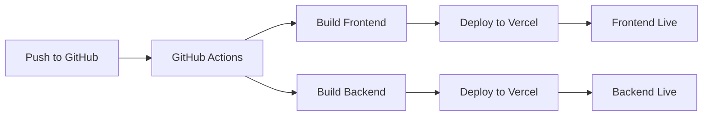

# 🎉 Vercel Deployment Setup Complete!

## ✅ What Was Accomplished

### 1. **Comprehensive .gitignore**
- ✅ Excludes all `node_modules/` directories
- ✅ Ignores build outputs (`dist/`, `build/`, `.next/`)
- ✅ Excludes environment files (`.env*`)
- ✅ Ignores SSL certificates and database files
- ✅ Excludes OS-specific and editor files
- ✅ Vercel and Turbo cache exclusions

### 2. **GitHub Actions Workflow**
- ✅ Automatic deployment on push to main/master
- ✅ Builds both frontend and backend
- ✅ Deploys to Vercel automatically
- ✅ Supports pull request previews

### 3. **Vercel Configuration**
- ✅ Frontend: Configured for static build with SPA routing
- ✅ Backend: Configured for serverless Node.js deployment
- ✅ Environment variables templates
- ✅ Production-ready settings

### 4. **Updated Backend for Vercel**
- ✅ Serverless-compatible main.ts
- ✅ Production CORS settings with Vercel domains
- ✅ Conditional Swagger (disabled in production)
- ✅ Proper initialization for serverless environment

### 5. **Deployment Tools**
- ✅ Comprehensive deployment guide
- ✅ Automated setup script (`setup-vercel.sh`)
- ✅ Environment variable templates
- ✅ Troubleshooting documentation

---

## 📁 New Files Created

```
📦 /Volumes/DevZone/OrderOverView/
├── .gitignore                           # ✅ Comprehensive ignore rules
├── .github/workflows/deploy.yml         # ✅ GitHub Actions workflow
├── setup-vercel.sh                     # ✅ Deployment setup script
├── DEPLOYMENT_GUIDE.md                 # ✅ Complete deployment guide
├── apps/frontend/
│   ├── vercel.json                      # ✅ Frontend Vercel config
│   └── .env.template                    # ✅ Environment template
└── apps/backend/
    ├── vercel.json                      # ✅ Backend Vercel config
    └── .env.template                    # ✅ Environment template
```

---

## 🚀 Next Steps for Deployment

### 1. **Initial Setup** (one-time)
```bash
# Make sure you have Vercel CLI
npm install -g vercel

# Run the setup script
./setup-vercel.sh
```

### 2. **GitHub Secrets Configuration**
Add these to your GitHub repository secrets:
- `VERCEL_TOKEN` - From vercel.com/account/tokens
- `VERCEL_ORG_ID` - From Vercel deployment output
- `VERCEL_PROJECT_ID` - Frontend project ID
- `VERCEL_BACKEND_PROJECT_ID` - Backend project ID

### 3. **Environment Variables**
Set in Vercel dashboard for production:
- `DATABASE_URL` - Production database connection
- `GROQ_API_KEY` - Your Groq API key
- `NODE_ENV` - Automatically set to "production"

### 4. **Update URLs**
After first deployment, update:
- Frontend `vercel.json` with actual backend URL
- Backend CORS settings with actual frontend URL

---

## 🔄 Automatic Deployment Workflow



**Triggers:**
- ✅ Push to `main` or `master` → Production deployment
- ✅ Pull requests → Preview deployments
- ✅ Both frontend and backend deploy simultaneously

---

## 🛠️ Local Development (unchanged)

```bash
# Install dependencies
pnpm install

# Start backend (HTTP mode)
cd apps/backend
pnpm run start:dev

# Start frontend (HTTP mode)
cd apps/frontend  
pnpm run dev
```

**Local URLs:**
- Frontend: `http://localhost:5173`
- Backend: `http://localhost:3001`
- API Docs: `http://localhost:3001/api/docs`

---

## 🎯 Production Architecture

```
┌─────────────────┐    HTTPS    ┌──────────────────┐    Database    ┌─────────────┐
│   Frontend      │ ←─────────→ │     Backend      │ ←─────────────→ │  Database   │
│ (Vercel Edge)   │             │ (Vercel Function)│                │ (External)  │
├─────────────────┤             ├──────────────────┤                ├─────────────┤
│ • Static Build  │             │ • Serverless     │                │ • PostgreSQL│
│ • SPA Routing   │             │ • Auto-scaling   │                │ • Connection│
│ • CDN Delivery  │             │ • Cold starts    │                │   Pooling   │
│ • SSL/HTTPS     │             │ • SSL/WSS        │                │ • Backups   │
└─────────────────┘             └──────────────────┘                └─────────────┘
```

---

## ✅ SSL/HTTPS Removed Successfully

All SSL-related code has been cleaned up:
- ❌ Removed SSL certificates and generation
- ❌ Removed `@vitejs/plugin-basic-ssl` dependency
- ❌ Removed HTTPS configuration from Vite
- ❌ Cleaned up environment variables
- ✅ **Vercel handles SSL automatically in production**

---

## 🎉 Ready for Production!

Your Glass Order Management System with LISA Voice Assistant is now:

- ✅ **Git-ready**: Proper .gitignore configuration
- ✅ **CI/CD-ready**: GitHub Actions workflow
- ✅ **Vercel-ready**: Configuration files in place
- ✅ **Production-ready**: Serverless backend setup
- ✅ **SSL-ready**: Automatic HTTPS in production
- ✅ **Scale-ready**: Serverless auto-scaling

**Status**: 🟢 **DEPLOYMENT READY**

Run `./setup-vercel.sh` to begin deployment! 🚀
